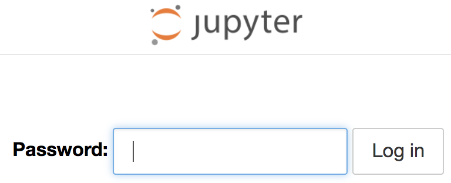
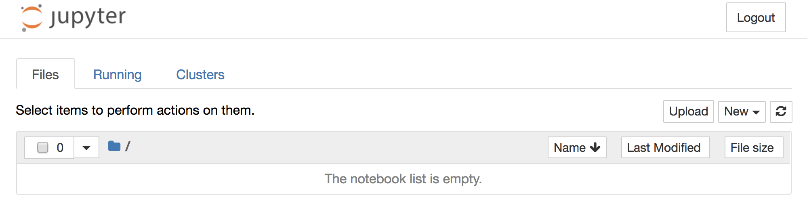

Once the deployment has completed, you can see what public hostname the Jupyter Notebook instance was given, by running:

```execute
oc get route experiments -o template --template '{{.spec.host}}{{"\n"}}'
```

The argument to `oc get route` is the name passed in the `APPLICATION_NAME` template parameter. In this case it was `experiments`.

Open the hostname from a new browser window. You should be presented with a form to enter a password. Use the same password as you used when you created the deployment.



Having logged in, you will then be presented with the Jupyter Notebook file browser, and can't start using the workspace.


