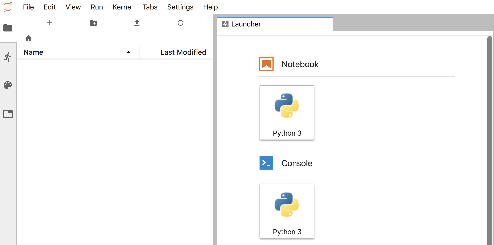

The Jupyter Notebook web interface which is used is the so called "classic" design. If you wish to use the new JupyterLab web interface design, you can do so by setting an environment variable in the deployment configuration to enable it. To do this, run the command:

```execute
oc set env deploymentconfig experiments JUPYTER_ENABLE_LAB=true
```

This will trigger a re-deployment of the Jupyter Notebook instance. You can monitor progress of the new deployment by running:

```execute
oc rollout status deploymentconfig experiments
```

Once the new deployment has finished, refresh the web interface for the Jupyter Notebook until the login page appears, enter your password, and you should see the JupyterLab web interface design.



If you prefer to always have the JupyterLab web interface design, you can instead edit and change the templates to make it the default. This way it will always be used when creating new Jupyter Notebook workspaces.
